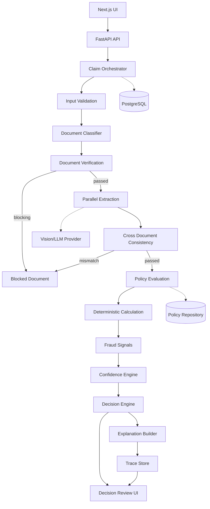

# Plum Claims AI — Architecture

## Goals

Priorities:
1. correctness
2. deterministic policy/money
3. early document verification
4. observability
5. graceful failure
6. structured AI
7. testability
8. usable UI

## Mermaid Architecture



## Why modular monolith

The assignment is time-limited. Component contracts give most of the architectural value while avoiding distributed-system overhead.

## AI boundary

AI:
- document classification
- extraction
- normalization
- semantic interpretation
- optional explanation

Deterministic:
- requirements
- policy
- waiting periods
- exclusions
- pre-auth
- limits
- money
- fraud thresholds
- final decision
- confidence

## Failure model

Critical -> stop/manual review.
Non-critical -> record, continue where safe, lower confidence, expose degraded state.

## Observability

Each event includes:
- trace ID
- claim ID
- step
- component
- status
- duration
- safe summaries
- evidence
- error
- retry count

## Security

Uploaded documents are untrusted:
- validate MIME/size
- sanitize filenames
- safe storage
- never execute
- minimize PII in logs
- sanitize API errors
- protect secrets

## 10x scaling

```text
API
 -> queue
 -> worker pools
      -> document workers
      -> extraction workers
      -> policy workers
      -> fraud workers
 -> PostgreSQL
 -> object storage
 -> cache
```

Contracts remain stable.

## Rejected alternatives

### One giant LLM
Too non-deterministic and difficult to test.

### Full microservices
Too much operational overhead for this assignment.

### LLM-only adjudication
Unsafe for deterministic policy and financial logic.

### Client-side policy logic
Not authoritative and difficult to secure.
